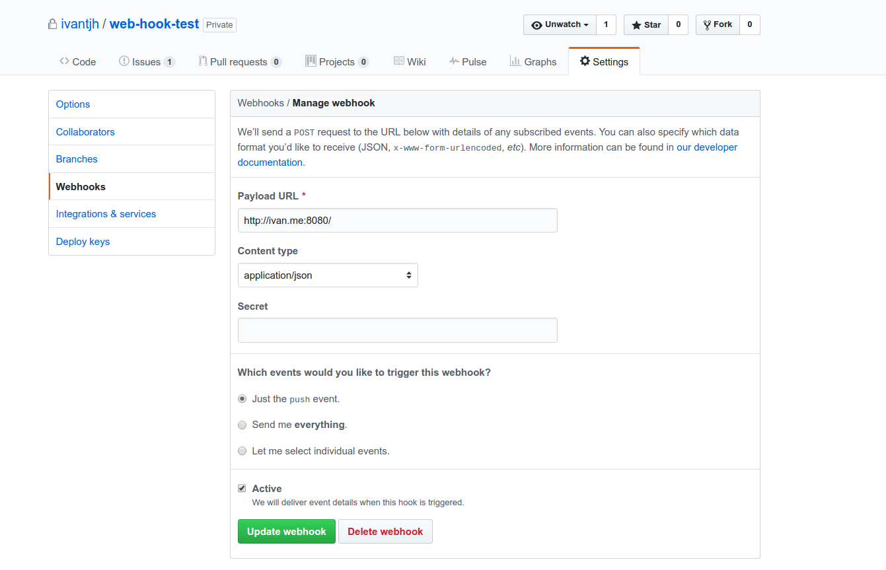

# Flow
Flow listens for push events from Github for a single or multiple repositories. Once a push event has been detected, Flow will run a deploy.sh located in the tracked repo.

## Compilation
Run `go get` and `go build`

## Configuration
### Github
1. Go to your repo's Settings page and click on Webhooks
2. Add a new Webhook
3. Configure accordingly to the image below

Payload URL - Set to your server's url. The most basic one without Nginx or other web server's configuration will be just to listen on the exposed port. An example will be `http://ivan.me:8080/`. The server runs on port 8080 by default. If a virtual host is set up, the url can be changed to `http://github-webhook.ivan.me/`.

Content type - application/json

Secret - If secret is set, remember to start Flow with the secret flag and the same secret key as the one on Github.

### Server
A sample config file has been provided in `sample.json`. Adjust accordingly. **Absolute paths** are needed for Flow to access the correct directory. Flow will not start without a config file.

Flow can be run as as a service using `systemd` or run in the background using `screen`.

To start flow, run `./flow -config config.json`.

### Logging
Logging directory can be configured using `-logs {directory}` flag. Give Flow permissions to write to the intended directory. Default log path is `/home/{user}/`.

### Secret
Secret can also be configured for additional layer of security. To configure, start Flow with a `-secret {secret_key}` flag and add the same `secret_key` to the repo's Webhook page.
